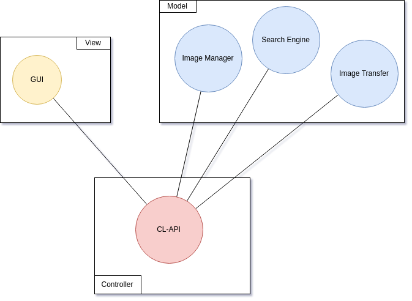

<h1 class="book-title">IMTRA</h1>
<h2>Image Manager and TRansfer Application</h2>

fecha

Unai Díaz, Marck Carrión

IMTRA

1

# Índice
1. [Introducción](#intro)
2. [Overview](#over)
3. Librerías
4. Módulo Image Transfer
   1. Introducción
   2. Esquema del módulo
   3. Base de datos
5. Módulo Image Manager
   1. Introducción
   2. Esquema del módulo
   3. Base de datos
   4. AI y auto etiquetado
6. Módulo Search Engine
   1. Introducción
   2. Esquema del módulo
   3. Base de datos
   4. Funciones de busqueda
7. Módulo CL-API
   1. Introducción
   2. Esquema del módulo
8. Integración
   1. Esquema de módulos
9. GUI

# 1. Introducción {#intro}
**Image Manager and TRansfer Application (IMTRA)** es un programa orientado a aquellos usuario de Linux que sean apasionados de la fotografía. Está desarrollado principalmente en __python 3__ y cuenta con una interfaz atractiva al público desarrollada con __tecnologías web__.

IMTRA surge de la necesidad de programas para la organización y transferencia de fotos en el entorno linux, pues como siempre ocurre en la comunidad linux, existen programas funcionales pero carecen de una interfaz gráfica agradable. Casi todos tienen interfaces que no siguen los estandares de dise&ntilde;o de interfaces. IMTRA proporciona una interfaz minimaista y limpia para que el usario tenga lo que necesita siempre a mano.

Así mismo _IMTRA_ desde el punto de vista del desarrollo permite utilizar sus modulos de forma independiente, se trata de una aplicación totalmente modular. __No existe una dependencia directa entre los módulos__ es el controlador de la aplicación quien se encarga de interconectarlas.

# 2. Overview {#over}
La aplicación cuenta con tres módulos principales más el controlador y la interfaz gráfica. Los tre módulos principales son:
- _Image Transfer_
- _Search Engine_ 
- _Image Manger_
  
La comunicación entre los módulos principales se hace mediante el módulo __CL-API (Command Line Application Programming Interface)__.

# 3. Librer&iacute;as {#lib}
En desarrollo de la aplicación se ha visto la necesidad de buscar librerías y APIs para facilitar y agilizar el desarrollo de la misma.
## 3.1 Interfaz
Para la interfaz se ha usado una librería que permite la creación de un servidor local temporal y mediante el motor de _Google Chrome_ o de _Chromiun_ permite visualizar una interfaz hecha completamente en __HTML 5__ y __CSS3__. Se trata de la libreía __[eel](https://pypi.org/project/Eel/)__.

## 3.2 Inteligencia Artificial
Para el tema de la _inteligencia artificial_ se ha utilizado una API REST __para agilizar el procesado de imágenes y evitar la dependencia del hardware__. En concreto se ha usado  [Clarifai](https://clarifai.com/).

# 4. Módulo Image Manager
Módulo encargado de la  importación de las imágenes,