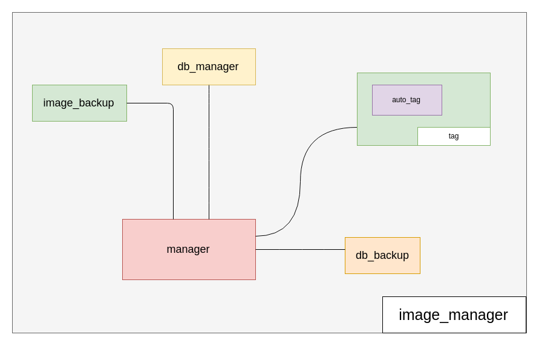

<div class="one-page">
<h1 class="book-title">IMTRA</h1>
<h2>Image Manager and TRansfer Application</h2>
<div class="footer">
<p class="date">fecha</p>
<p class="authors">Unai Díaz, Marck Carrión</p>
</div>
</div>

<div class="header">
<p class="name">IMTRA</p>
</div>

# Índice
1. [Introducción](#intro)
2. [WorkFlow](#wf)
3. [Overview](#over)
4. [Librerías](#lib)
5. [Módulo Image Transfer](#im_tr)
   1. Introducción
   2. Esquema del módulo
   3. Base de datos
6. [Módulo Image Manager](#im_ma)
   1. [Introducción](#im_ma_i)
   2. Esquema del módulo
   3. Base de datos
   4. AI y auto etiquetado
7. Módulo Search Engine
   1. Introducción
   2. Esquema del módulo
   3. Base de datos
   4. Funciones de busqueda
8. Módulo CL-API
   1. Introducción
   2. Esquema del módulo
9. Integración
   1. Esquema de módulos
10. GUI

# 1. Introducción {#intro}
**Image Manager and TRansfer Application (IMTRA)** es un programa orientado a aquellos usuario de Linux que sean apasionados de la fotografía. Está desarrollado principalmente en __python 3__ y cuenta con una interfaz atractiva al público desarrollada con __tecnologías web__.

IMTRA surge de la necesidad de programas para la organización y transferencia de fotos en el entorno linux, pues como siempre ocurre en la comunidad linux, existen programas funcionales pero carecen de una interfaz gráfica agradable. Casi todos tienen interfaces que no siguen los estandares de dise&ntilde;o de interfaces. IMTRA proporciona una interfaz minimaista y limpia para que el usario tenga lo que necesita siempre a mano.

Así mismo _IMTRA_ desde el punto de vista del desarrollo permite utilizar sus modulos de forma independiente, se trata de una aplicación totalmente modular. __No existe una dependencia directa entre los módulos__ es el controlador de la aplicación quien se encarga de interconectarlas.

# 2. WorkFlow {#wf}
Para el desarrollo del proyecto se preestableció un _flujo de trabajo (WorkFlow)_ para automatizar el trabajo en grupo y evitar posibles conflictos.
El workflow empieza con el desarrollo de código, bien sea una función, un método o una clase entera, al terminarla el desarrollador se encarga de probar el código que acaba de escribir, realizando las pruebas que vea necesarias, en busca de errores. 

En caso de encontrar algún error en su código se volverá al principio, esta vez para arreglar los errores.
 
Si no ha encontrado ningún error se pasará a hacer una pull request, se creará una rama nueva en el repositorio remoto. 
 
Estos combios se mantendran en la rama temporal hasta que otro miembro del grupo lo revise para comprobar que está comentado correctamente, que no haya errores de ejecución ni de compilación.
Una vez comprobado que todo es correcto se procede a fusionar la rama temporal con la principal

 


# 3. Overview {#over}
La aplicación cuenta con tres módulos principales más el controlador y la interfaz gráfica. Los tre módulos principales son:
- _Image Transfer_
- _Search Engine_ 
- _Image Manger_
  
La comunicación entre los módulos principales se hace mediante el módulo __CL-API (Command Line Application Programming Interface)__.


# 4. Librer&iacute;as {#lib}
En desarrollo de la aplicación se ha visto la necesidad de buscar librerías y APIs para facilitar y agilizar el desarrollo de la misma.
## 4.1 Interfaz 
Para la interfaz se ha usado una librería que permite la creación de un servidor local temporal y mediante el motor de _Google Chrome_ o de _Chromiun_ permite visualizar una interfaz hecha completamente en __HTML 5__ y __CSS3__. Se trata de la libreía __[eel](https://pypi.org/project/Eel/)__.

## 4.2 Inteligencia Artificial
Para el tema de la _inteligencia artificial_ se ha utilizado una API REST __para agilizar el procesado de imágenes y evitar la dependencia del hardware__. En concreto se ha usado  [Clarifai](https://clarifai.com/).
# 5. Módulo Image Transfer {#im_tr}
Este módulo se encarga de la transferencia de imágenes desde la carpeta de origen a la de destino, establecidas por el usuario. Durante la transferencia se generan carpetas siguiendo un patrón.
## 5.1 Introducción
El módulo consta de clases y funciones que están orientadas a la transferencias de imágenes, que facilitan la lectura de algunos metadatos de las imágenes.

## 5.2 Esquema del módulo {#im_m}
El módulo tiene tres submodulos: 
- _transfer_
- _path_
- *db_manager*


Los submodulos **transfer** y **path** trabajan conjuntamente para poder generar la estructura de carpetas leyendo la fecha de cada imagen y creando la carpeta. El funcionamiento es el siguiente:


Necesita los directorios de origen, donde se encuentran todas las imágenes, y un directorio de destino, donde se generará la estructura de carpetas. También necesita un patrón para poder generar la estructura de carpetas, el cual vendrá por defecto pudiendo cambiarla pasandola como parametro.
```python
def dir(d, format = 'yyyy/MM/dd-MM-yy', sys_date=False):
```
Para generar la carpeta que corresponde a cada imagen, tambén se le pasa la misma imagen, la cual se lee y se extrae la fecha con la se juega para crear la estructura de carpetas.
Para el patrón `yyyy/MM/dd-MM-yy` se consigue una estructura:


# 6. Módulo Image Manager {#im_ma}
La función principal del módulo es la organización de imágenes y la etiquetación de las mismas.
## 6.1 Introducción {#im_ma_i}


## 6.2 Esquema del módulo
Este consta de un etiquetador automático, una base de datos propia y un sistema de copias de seguridad.


#### 6.1.1 Etiquetador Automatico
Mediante una _API REST_ de inteligencia artificial se procesa la imagen y detecta los elementos que se encuentran en la imagen.
El funcionamiento es simple, la función  recibe una imagen que la lee de forma binaria y envía los bytes al servidor, este los procesa mediante inteligencia artificial, tomando como referencia un modelo preestablecido, y devuelve un archivo en __JSON__. La respuesta se procesa y se almacena en una base de datos embebida.


#### 6.1.2 Backup Tools
Permite crear copias de seguridad de las carpetas y las imágenes que se le pasas como argumento. Utiliza la compresión tar para comprimir todos las carpetas de la forma más efieciente.
## 6.3 Base de datos
El administrador de imágenes utiliza una tabla para relacionar la imágen con un id, esto se hace para no almacenarla directamente, se relaciona la dirección absoluta de la imágen con un id numérico. Esto nos resultará utili para trabajar de forma más abstracta con las imágenes y poder crear interrelaciones con los otros módulos.

La base de datos interrelaciona las etiquetas que se leen desde el servidor con la imagen correspondiente.