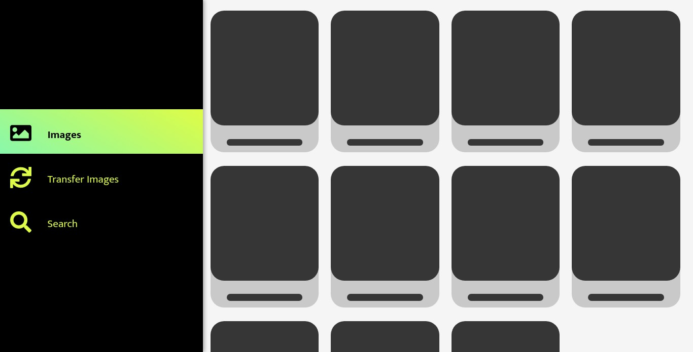

# IMTRA
###### Unai Díaz de Garayo | Marck Carrión
---
## Manual de usuario
La aplicación consta de tres vistas, una por cada módulo principal:
- Image Manager
- Image Transfer
- Search Engine

# 1. Image Manager

Se disponen las imágenes en forma de cuadrícula

# 2. Image Transfer
Para la pantalla de transferencias se encuentra un diálogo central en el que se dispondrán los campos de texto para introducir la carpeta de origen y de destino. A la derecha de cada cuadro de texto se encuentra un botón que nos abre una ventana modal para seleccionar la carpeta de forma gráfica.
Con el botón __transfer__ iniciamos la transferencia de imágenes.

# 3. Search
Solo consta de un cuadro de texto para introducir la búsqueda, al clicar sobre el botón, se abre un submenú para seleccionar el campo de búsqueda, para establecer el _filtro_.
